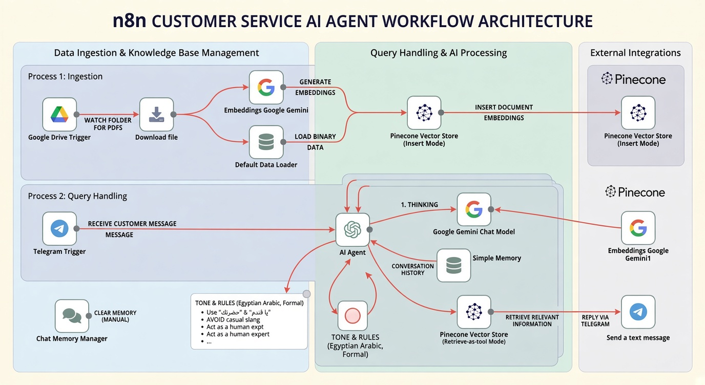

#  RAG-Powered AI Customer Service Agent for Premium Auto Dealerships

This repository contains a complete **n8n** workflow designed to build a highly intelligent customer service assistant for an automotive service center. By leveraging Retrieval-Augmented Generation (RAG), the system autonomously reads operational policies and provides highly accurate, context-aware responses to clients via Telegram. 

##  Core Features
* **Automated Data Ingestion:** The system actively monitors a designated Google Drive folder. Whenever a new policy document (e.g.,"Maintenance and Customer Service Policy.pdf") is uploaded or updated, the system automatically fetches and processes it[cite: 1, 2].
* **High-Precision Retrieval (RAG):** Integrates Pinecone vector database with Google Gemini embeddings to deeply understand the semantic meaning of the service policies and retrieve the exact rules before answering.
* **VIP AI Persona:** The AI agent is strictly prompted to act as a premium customer service representative. It replies in formal, polite Egyptian Arabic (using terms like "يا فندم" and "حضرتك") while strictly avoiding cheap slang or overly familiar tone.
* **Contextual Memory:** Utilizes a Buffer Window Memory node linked to the user's Telegram Chat ID, allowing the agent to remember previous turns in the conversation for a seamless chat experience.

##  Architecture & Pipelines

The n8n workflow is divided into two parallel pipelines operating seamlessly together:

### 1. The Data Ingestion Pipeline
| Component | Function |
| :--- | :--- |
| **Google Drive Trigger** | Listens for new files in the specified drive folder and initiates the download process. |
| **Document Data Loader** | Extracts the raw text from the downloaded PDF files. |
| **Gemini Embeddings** | Converts the extracted text chunks into high-dimensional vector representations. |
| **Pinecone Vector Store** | Upserts the vectors into a dedicated Pinecone index named `cars` for rapid semantic search. |

### 2. The Conversational AI Pipeline
| Component | Function |
| :--- | :--- |
| **Telegram Trigger** | Captures real-time incoming messages and inquiries from clients. |
| **Vector Store (Tool)** | Acts as a search tool for the AI Agent to query the `cars` index for factual policy data before formulating an answer. |
| **Gemini 3.1 Flash-Lite** | The core LLM powering the agent, responsible for reasoning and generating the final professional response. |
| **Memory Buffer** | Manages session history based on the user's unique Telegram ID to maintain conversation context. |

##  Knowledge Base Scope
Based on the provided documentation, the AI is fully equipped to handle inquiries regarding:
* **Inspection & Pricing:** Free initial inspections for out-of-warranty cars and strict policies on upfront price quotations[cite: 1].
* **Maintenance Schedules:** Detailed guidelines for mileage-based maintenance covering 5,000 km up to 60,000 km intervals[cite: 1].
* **Warranties:** Operational guarantees covering labor for 30 days or 1,000 km (whichever comes first)[cite: 1].
* **Consumer Protection:** Clear protocols for handling post-maintenance faults and external spare parts returns[cite: 1].
* **Payment Methods:** Support for Cash, Credit/Debit cards, and instant bank transfers via InstaPay[cite: 1].

##  Deployment Prerequisites
To import and run this workflow (`C.S_Rag_Pinecone_Cars.json`) on your own n8n instance, you will need to configure the following credentials:
* **Google Drive OAuth2 API:** For folder monitoring and file reading.
* **Pinecone API:** Connected to a cloud index named `cars`.
* **Google Gemini (PaLM) API:** For both the Chat Model and Embeddings generation.
* **Telegram Bot Token:** To connect the workflow to your Telegram bot for sending and receiving messages.